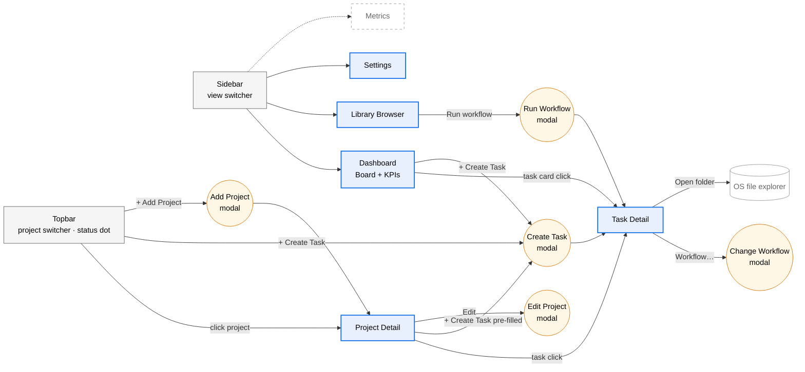
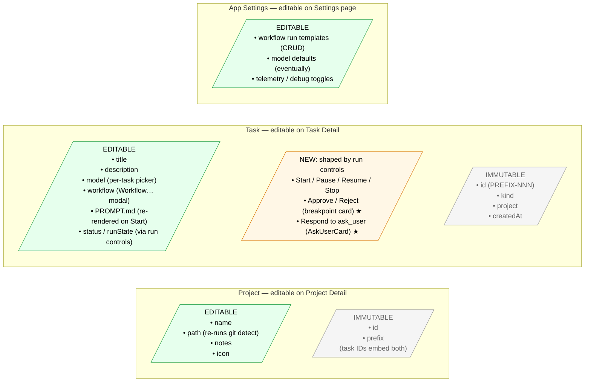
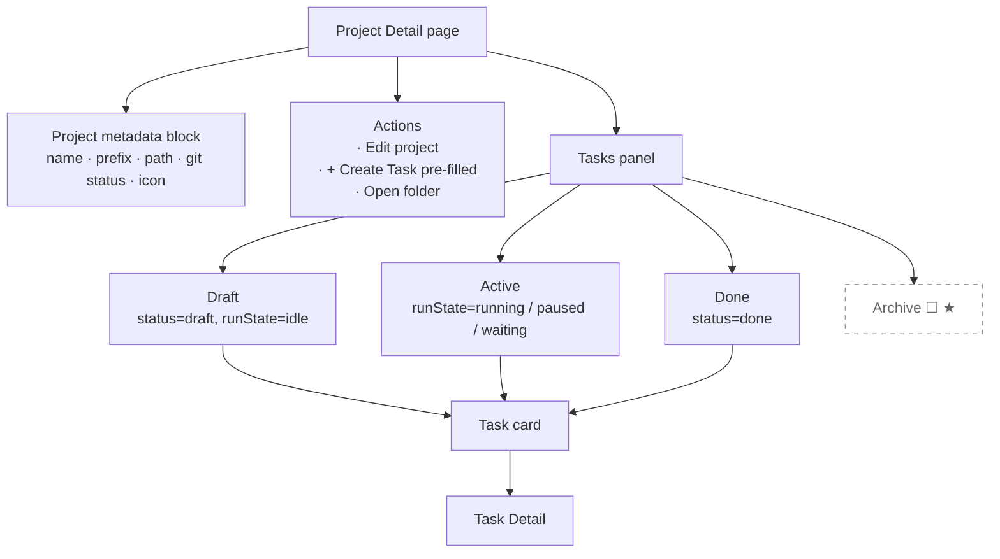
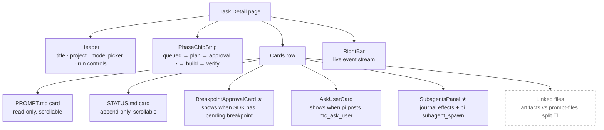

# UI flow — MC frontend at a glance

This is a wireframe-level map of the app's frontend: pages, the
transitions between them, what fields the user fills vs what the system
fills, and what's wired today vs pending.

It does **not** describe babysitter / pi internals. For that, see
`SDK-PRIMITIVES.md`. For visual rules (palette, accents, "what's dead"),
see `UI-DESIGN.md`.

**Format**: Mermaid. Rendered in GitHub, VS Code (with the Markdown
Preview Mermaid extension), and most IDEs. Solid edges = working today,
dashed edges = pending / not yet wired.

---

## 1 · Top-level navigation



---

## 2 · Adding things — what the user provides vs what the system fills

```mermaid
flowchart TD
    subgraph add_proj [Add Project]
        AP_user[/"USER FILLS<br/>• id (slug, immutable)<br/>• name<br/>• prefix (immutable)<br/>• path (optional, triggers git detect)<br/>• notes (optional)<br/>• icon (optional)"/]:::user
        AP_sys[/"SYSTEM FILLS<br/>• createdAt<br/>• updatedAt<br/>• gitInfo (auto-detected from path)"/]:::system
        AP_user --> AP_sys
    end

    subgraph add_task [Create Task]
        CT_user[/"USER FILLS<br/>• title<br/>• description<br/>• project (picker)<br/>• kind (single / campaign)<br/>• workflow (library picker, optional)<br/>• inputs (rendered from workflow's inputsSchema if present) ★<br/>• items (campaign only)"/]:::user
        CT_sys[/"SYSTEM FILLS<br/>• id = PREFIX-NNN<br/>• status = draft<br/>• runState = idle<br/>• cycle = 0<br/>• createdAt / updatedAt<br/>• PROMPT.md (rendered on Start)<br/>• STATUS.md (empty, append-only)<br/>• RUN_CONFIG.json (if workflow chosen)"/]:::system
        CT_user --> CT_sys
    end

    subgraph add_run [Run Workflow from Library]
        RW_user[/"USER FILLS<br/>• project (picker)<br/>• title (optional, derived if blank)<br/>• inputs (from workflow's inputsSchema)<br/>• model (optional)<br/>• save as template? ☐"/]:::user
        RW_sys[/"SYSTEM FILLS<br/>• creates a Task with workflow pre-bound<br/>• can land on existing template (preload values)"/]:::system
        RW_user --> RW_sys
    end

    classDef user fill:#e6ffed,stroke:#2da44e,color:#000
    classDef system fill:#f0f0f0,stroke:#666,color:#000
```



★ = inputs schema rendering on Create Task is **partial** — picker
exists, but if the workflow declares a non-trivial `inputsSchema`, the
form doesn't render fields yet. Today the workaround is the "Run
Workflow" path from Library, which always renders the schema.
*Pending: fold the inputs form into Create Task, or redirect to Run
Workflow when the chosen workflow has a schema.*

---

## 3 · Modifying things — what's editable, where



★ = wired in main but renderer migration to SDK-authoritative
`window.mc.runListPending` is the next concrete step (see
`SDK-PRIMITIVES.md` § next steps).

---

## 4 · Project Detail — what's on the page



★ = **Archive** state isn't in the schema today. Today's grouping is
state-derived (idle / running / waiting / done / failed). The mockup
called for explicit `archive` — this is a small `TaskSchema` change
+ a UI grouping change. *Pending decision: do we add `archived: true`
or keep it state-derived?*

---

## 5 · Task Detail — what's on the page



★ = wired today via `derive-*` helpers reading `events.jsonl`. The
SDK-authoritative IPCs (`runs:listPending`, `runs:status`) exist on the
preload but the renderer still uses the derive helpers. Migration is
the next concrete step.

☐ = Linked files panel exists but doesn't yet split artifacts (run
outputs) from prompt-linked files (inputs). Needs babysitter to write
an artifact sidecar — out of MC's hands until then.

---

## 6 · Run lifecycle — what happens after Start

```mermaid
flowchart TD
    Start([User clicks Start])
    HasWf{RUN_CONFIG names<br/>library workflow?}
    Curated[Curated path<br/>spawn `babysitter harness:create-run --process workflow.js`]
    AutoGen[Auto-gen path<br/>pi.session.prompt('/babysit brief')<br/>requires babysitter-pi extension]

    Start --> HasWf
    HasWf -->|yes| Curated
    HasWf -->|no| AutoGen

    Curated --> Iter[SDK iteration loop<br/>orchestrateIteration runs to completion or effect]
    AutoGen --> Iter

    Iter --> Out{Outcome}
    Out -->|completed| Done[RUN_COMPLETED<br/>+ completionProof token ☐]:::pending
    Out -->|failed| Fail[RUN_FAILED<br/>error in journal]
    Out -->|waiting| Pending[Pending effects<br/>breakpoint · sleep · custom kind]

    Pending -->|breakpoint| ApprovalCard[Approval card on TaskDetail<br/>user clicks Approve / Reject]
    ApprovalCard -->|POST| TaskPost[`babysitter task:post --status ok --value-inline`]
    TaskPost --> Iter

    Pending -->|sleep / other| Auto[SDK auto-resolves<br/>or waits per kind]
    Auto --> Iter

    classDef pending fill:#fff,stroke:#999,stroke-dasharray:5 5,color:#666
```

☐ = `completionProof` is generated by the SDK and lives in `run.json`,
but MC doesn't surface it yet. *Pending: tiny "verified done" chip near
"Run ended."*

---

## 7 · Legend

| Style | Meaning |
|---|---|
| Solid edge | Working today |
| Dashed edge / `:::pending` | Wired in main but renderer not migrated, OR not started |
| ★ | Next concrete step from `SDK-PRIMITIVES.md` |
| ☐ | Not started — needs decision or upstream work |

---

## 8 · CRUD gap inventory — what's missing per entity

This is the "did we forget to build the X for Y" matrix. Each entity
gets the standard verbs; ✓ = wired today, ☐ = not surfaced in UI even
if the IPC / schema supports it.

### Project

| Verb | UI surface | Status |
|---|---|---|
| Create | Topbar "+ Add Project" → AddProjectForm | ✓ |
| List | Topbar switcher · Sidebar | ✓ |
| Read (detail) | Project Detail page | ✓ |
| Edit | Project Detail "Edit" button | ✓ |
| Archive | — | ☐ no concept on Project |
| Delete | Project Detail (confirmation) | ✓ |
| Re-detect git | Auto on path change | ✓ |

### Task

| Verb | UI surface | Status |
|---|---|---|
| Create | Topbar / Board / ProjectDetail "+ Create Task" | ✓ |
| List | Board (banded by run state) · ProjectDetail (flat) | ✓ |
| Read (detail) | Task Detail page | ✓ |
| Edit title/description | Task Detail (EditTaskForm) | ✓ |
| Edit workflow | Task Detail "Workflow…" → ChangeWorkflowModal | ✓ |
| Edit model | Task Detail model picker | ✓ |
| **Archive** | — | ☐ schema supports it (`status: "archived"`) but no UI to set/filter/unarchive |
| Delete | Task Detail | ✓ |
| **Re-run / clone with changes** | — | ☐ today: delete + recreate |
| **Hide / mute notifications** | — | ☐ no concept |
| Pause / Resume / Stop | Task Detail run controls | ✓ (MC-state only — pi keeps going) |

### Workflow (library entry)

| Verb | UI surface | Status |
|---|---|---|
| Create | — | ☐ author manually under `library/`, then `npm run build-library-index` |
| List | Library Browser | ✓ |
| Read (detail) | Library Browser (read-only) | ✓ |
| Edit | — | ☐ filesystem only |
| Run | Library "Run" → RunWorkflowModal → Task | ✓ |
| Archive / hide | — | ☐ no concept |
| Delete | — | ☐ filesystem only |
| **Save run as Template** | RunWorkflowModal "Save as template" | ✓ |

### Workflow Run Template

| Verb | UI surface | Status |
|---|---|---|
| Create | RunWorkflowModal save toggle | ✓ |
| List | Settings page | ✓ |
| Edit | — | ☐ delete + recreate |
| Delete | Settings | ✓ |
| **Apply on Create Task** | — | ☐ pending — Create Task can't load a template as a starting point |

### Model

| Verb | UI surface | Status |
|---|---|---|
| List | Task Detail picker (pulls from pi's ModelRegistry) | ✓ |
| CRUD | — | n/a — pi-managed, MC just consumes |

### App Settings

| Verb | UI surface | Status |
|---|---|---|
| Read | Settings page | ✓ |
| Edit | Settings page | ✓ |
| Per-project memory | — | ☐ pending — pi-memory-md wire-up |

### Run / Run history

| Verb | UI surface | Status |
|---|---|---|
| Start | Task Detail | ✓ (curated + auto-gen paths) |
| View live progress | Task Detail (RightBar, PhaseChipStrip, cards) | ✓ |
| View history | Task Detail "Run history" cards | ✓ |
| Inspect SDK run dir | "Open folder" → OS reveal | ✓ |
| Cancel mid-iteration | Stop button | ⚠️ MC-state; SDK keeps iterating |
| **completionProof** | — | ☐ generated by SDK, not surfaced |
| **Iteration count** | — | ☐ tracked by SDK, not surfaced |

---

## 9 · What this inventory makes visible

The verbs that are missing across multiple entities cluster into three
real product gaps:

1. **No archive verb anywhere.** Schema supports `archived` status on
   tasks; no Project archive concept. Cheapest win: add an Archive
   button + filter on Task Detail / Board, since the schema's already
   there. Project archive is a bigger ask (immutable id/prefix means
   "archived project" probably means "hidden from switcher").
2. **No edit-in-place for library entries or templates.** Workflows
   are filesystem-only (intentional — they're code), but templates
   are JSON and Settings has no edit form for them. Either add inline
   edit or accept "delete + re-save."
3. **No re-run / clone affordance.** Single biggest "I want this"
   gap: today the only way to re-run with different settings is
   delete + recreate. A "Re-run with…" button on Task Detail that
   pre-fills CreateTaskForm with the current task's values would
   close it.

---

## 10 · Direction questions this surfaces

These are the architecturally interesting forks the diagram makes
visible. Each is worth a yes/no before more code lands:

1. **Archive state on tasks** — explicit `archived: true` field, or
   keep grouping state-derived? Affects ProjectDetail and Board.
2. **Inputs schema on Create Task** — fold it into the modal, or
   redirect to Run Workflow when the chosen workflow has a schema?
3. **Approval card scope** — keep it breakpoint-only, or broaden to a
   generic "Pending effects" card that handles approvals + future
   effect kinds (sleep, custom)? SDK's `task:list --pending` already
   returns all of them.
4. **Phase chip data source** — keep `derivePhases` (journal history)
   for the timeline, but light up the "current" chip from
   `runs:status`? Two-source split.
5. **completionProof surfacing** — show it inline on Task Detail, or
   debug-only?
6. **Iteration count** — show "Iteration N" badge always, or
   debug-only?

---

## How to extend this doc

- Pages or modals get added → add a node in §1, plus a fields block in
  §2 or §3.
- A surface flips from pending to wired → solid edge + drop the
  `:::pending` class.
- A new run primitive lands (e.g. cancel-with-cleanup) → add to §6.

Keep edits in this file — Mermaid renders inline, no separate diagram
file to drift from.
