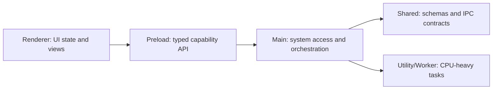

# electron-architect

Use this skill to provide senior-level Electron architecture guidance. Favor repo-specific evidence over generic advice, and delegate narrow implementation details to related skills when they fit.

## Workflow

1. Identify the task type: architecture review, security audit, performance analysis, IPC design, packaging/deployment, native integration, tray/protocol feature design, testing/mocking, or migration planning.
2. Inspect project shape before recommending changes: Electron version, `main`, `preload`, `renderer`, `shared` modules, build config, package scripts, IPC registrations, BrowserWindow options, and platform-specific code.
3. Load [references/architecture-playbook.md](references/architecture-playbook.md) when the request spans multiple areas or needs a structured checklist.
4. Use the related Electron skills for focused work:
   - `electron-ipc-security-audit` for IPC vulnerability review.
   - `electron-main-preload-generator` for secure boilerplate.
   - `electron-builder-config` for packaging and `electron-builder` setup.
   - `electron-auto-updater-setup` for update channels and signing-sensitive updater flow.
   - `electron-tray-menu-builder` for tray and menu UX.
   - `electron-protocol-handler-setup` for deep links and custom protocols.
   - `electron-memory-profiler` for memory and leak analysis.
   - `electron-native-addon-builder` for native modules.
   - `electron-mock-factory` for testing doubles and mocks.
5. Produce findings with severity, tradeoffs, and implementation order. Do not over-prescribe rewrites when targeted boundary changes solve the risk.

## Architecture Principles

- Keep system access in the main process; keep UI and untrusted content in renderer processes.
- Treat preload as a narrow capability membrane, not a convenience layer.
- Prefer typed `ipcMain.handle`/`ipcRenderer.invoke` request-response channels for commands and explicit subscription APIs for events.
- Validate all renderer-originated input in the main process, even when the preload validates too.
- Keep shared types and schemas in a process-neutral module without Node-only or DOM-only dependencies.
- Isolate heavy CPU work in utility processes or worker threads; avoid blocking the main process.
- Design cross-platform behavior through explicit adapters, not scattered `process.platform` checks.

## Security Baseline

Check these before deeper architecture work:

- `contextIsolation: true`
- `nodeIntegration: false`
- `sandbox: true` where practical
- `webSecurity: true`
- No direct `ipcRenderer` exposure through `contextBridge`
- IPC channels are named, minimal, validated, and authorized
- Navigation and window-open handlers restrict external URLs
- CSP is defined for production renderer content
- Secrets stay in OS keychain/env/backend services, not renderer storage
- Code signing, notarization, and update signature verification are planned for distribution

## Performance Baseline

Use these thresholds as review heuristics:

| Metric | Target | Critical |
| --- | ---: | ---: |
| Cold start | < 3s | > 8s |
| Idle memory | < 150MB | > 500MB |
| Installer/app size | < 100MB | > 300MB |
| IPC round trip | < 10ms | > 100ms |

For startup issues, inspect app initialization order, synchronous filesystem work, eager imports, renderer bundle size, and BrowserWindow creation timing. For memory issues, inspect listener cleanup, BrowserWindow lifecycle, retained webContents, caches, and large serialized IPC payloads.

## Output Format

Default to Markdown:

```markdown
## Summary
## Findings
## Recommended Architecture
## IPC/Security Notes
## Performance Notes
## Implementation Plan
## Open Questions
```

For structured output, use:

```json
{
  "analysis": {
    "summary": "",
    "findings": [
      {
        "area": "ipc",
        "observation": "",
        "severity": "warning",
        "recommendation": ""
      }
    ]
  },
  "recommendations": [
    {
      "title": "",
      "description": "",
      "priority": "high",
      "effort": "medium",
      "codeExample": ""
    }
  ],
  "architecture": {
    "diagram": "",
    "components": [
      {
        "name": "Preload API",
        "responsibility": "Expose validated renderer capabilities",
        "process": "shared"
      }
    ]
  },
  "resources": []
}
```

## Example Architecture Sketch



## Response Rules

- Lead with risks and decisions, not Electron background.
- Include file references when reviewing an existing app.
- Separate must-fix security issues from maintainability improvements.
- Mention platform-specific behavior for Windows, macOS, and Linux when relevant.
- When official Electron behavior may have changed, verify against current Electron docs before giving version-specific migration guidance.
